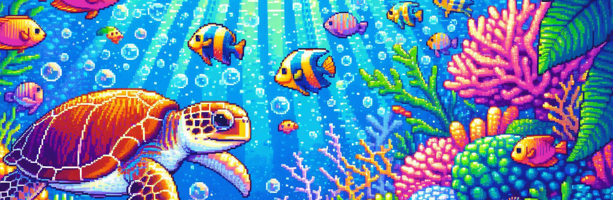

<!DOCTYPE html>
<html lang="en">

<head>
    <meta charset="UTF-8">
    <meta name="viewport" content="width=device-width, initial-scale=1.0">
    <!--     <title>README</title> -->
</head>

<body>

  

 

  
  

# DevRACode.dev 
### [ Development • Refined • Application • Code ]

> **"La única manera de hacer un gran trabajo es amar lo que haces." - Steve Jobs**

Soy una desarrolladora enfocada en la **mejora continua** y la **excelencia técnica**. Si el código no es robusto, escalable y limpio, no está terminado.

---

### 🛠 Mi Filosofía de Trabajo

* **Dev**elopment: Desarollo sostenible y con visión de futuro.
* **R**efined: Refinamiento y mejora constante del código.
* **A**pplication: Aplicaciones que resuelven problemas reales.
* **Code**: Código con conciencia. Nada de copiar y pegar código de una IA sin entender lo que estoy haciendo.

---

### 🎯 En qué me enfoco

* **Código Limpio:** Buenas prácticas para el desarrollo de aplicaciones
* **Rigor Técnico:** Si hay un problema que resolver, no se dejará para más adelante.
* **Refactorización Obsesiva:** Si se puede hacer mejor, se hará mejor.

---

### 🚀 Stack & Toolbox

<table>
    <tr>
        <td style="font-weight: bold; padding-right: 10px; vertical-align: center; border: none;">Backend:</td>
        <td></td>
    </tr>
    <tr>
        <td style="font-weight: bold; padding-right: 10px; vertical-align: center;">Frontend:</td>
        <td></td>
    </tr>
    <tr>
        <td style="font-weight: bold; padding-right: 10px; vertical-align: center; border: none;">Database:</td>
        <td></td>
    </tr>
    <tr>
        <td style="font-weight: bold; padding-right: 10px; vertical-align: center; border: none;">DevOps:</td>
        <td></td>
    </tr>
    <tr>
        <td style="font-weight: bold; padding-right: 10px; vertical-align: center; border: none;">Version Control:</td>
        <td></td>
    </tr>
    <tr>
        <td style="font-weight: bold; padding-right: 10px; vertical-align: center; border: none;">Ides:</td>
        <td></td>
    </tr>
    <tr>
        <td style="font-weight: bold; padding-right: 10px; vertical-align: center; border: none;">Operating Systems:</td>
        <td></td>
    </tr>
</table>   

---

	

</body>

</html>
